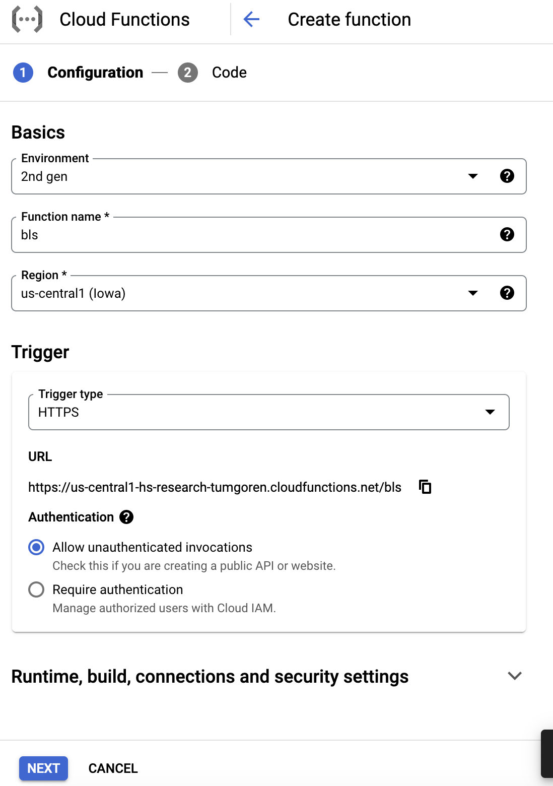
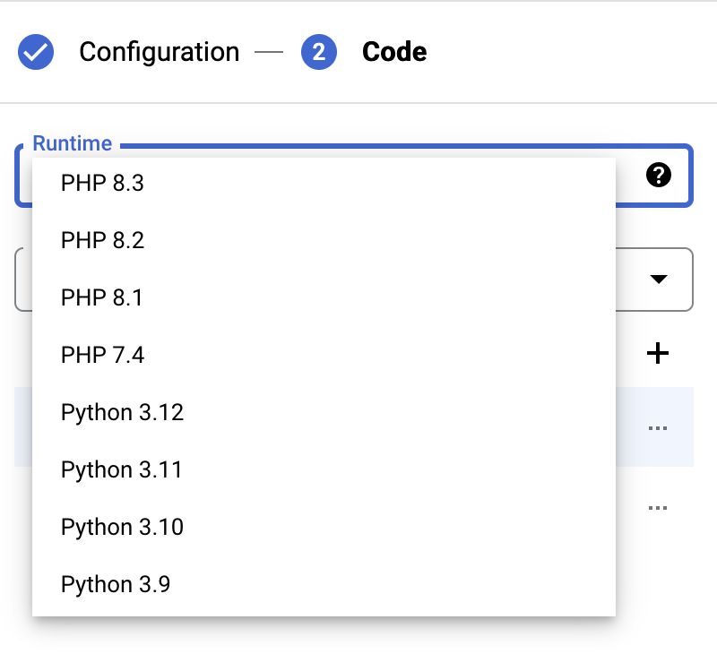
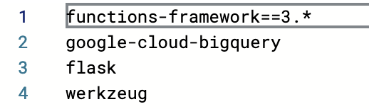
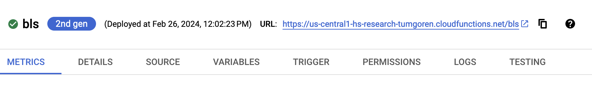

# BLA API

So you've completed the [hello world API call](api_hello_world.md) and loaded BLS data into [BigQuery](bigquery.md).

We're now ready to create a Cloud Function that can dynamically query BigQuery when supplied with an arbitrary county name and state.

This will provide the ability for us to create a Vega-Lite chart that allows users to choose the county they'd like to see visualized.

## Hello BLS API

We'll set up this new API in the same way as the [hello world example](api_hello_world.md).

Go to the GCP Console and navigate to the `Cloud Functions` dashboard.

> Remember, you can use the search bar at top of the GCP console.

Once on the Cloud Functions page, click `CREATE FUNCTION` at the top of the page.

This should call up the form to create a new function.

Create a function named `bls` with the following settings:

- Environment: `2nd gen`
- Function name: `bls`
- Region: `us-central1 (Iowa)`
- Trigger type: `HTTPS`
- Authentication: `Allow unauthenticated invocations`

It should look like this:



Click `NEXT` at the bottom of the form.

You should now be on the code configuration page.

Change the `Runtime` to Python 3.11.



That should update the code to Python.

Notice that you are currently editing the `main.py` file in the code editor.

But there's also a `requirements.txt` file, where you can add additional software for your Python program.

In order for our API to query the BLS data over on BigQuery, we'll need to add a new library. We'll also include a web framework called Flask and a library called `werkzeug` that will help us deal with some headaches related to requesting data from an API.

Click on `requirements.txt` and add the libraries, each on a separate line: 

- `google-cloud-bigquery`
- `flask`
- `werkzeug`

The file should now look like this:



Next, click back over to `main.py`.

Update the `Entry point` value to `county_data`. This is the name of the Python function that will be called when the API's URL is called.

Next, replace the contents of `main.py` with the following code and then click `DEPLOY` at the bottom of the page. This step will take a minute or two.

> We'll walk through each line of this code together.

```python
import functions_framework

from flask import jsonify, make_response
from google.cloud import bigquery
from werkzeug.datastructures import Headers

client = bigquery.Client()


@functions_framework.http
def county_data(request):
  # Handle request
  if request.args and 'county' in request.args and 'state' in request.args:
    county = request.args['county']
    state = request.args['state']
  else:
    return ('You must supply the county and state URL paramters', 204)
  query = (
          "SELECT * "
          "FROM `hs-research-tumgoren.bls.unemployment` "
          f"WHERE `county` = '{county}' and `state` = '{state}';"
        )
  query_job = client.query(query)
  data = []
  for row in query_job:
    area = row['area']
    county = row['county']
    state = row['state']
    data.append({
    'month_abbrev': row['month_name'],
    'date': f"{row['year']}-{row['month']}-01",
    'civ_labor_force': row['civ_labor_force'],
    'employed': row['employed'],
    'unemployed': row['unemployed'],
    'unemployed': row['unemployed_rate']
  })
  # Update headers to allow CORS
  # Better would be to use flask-cors
  headers = Headers()
  headers.add('Access-Control-Allow-Origin', '*')
  headers.add('Access-Control-Allow-Methods', 'GET')
  headers.add('Access-Control-Allow-Headers', 'Content-Type')
  headers.add('Access-Control-Max-Age', '300')
  resp = make_response(
    jsonify(
              area=area,
              county=county,
              state=state,
              data=data
            )
  )
  resp.headers = headers
  return resp
```

## Test the API

Once the deployment is complete, you should see a green circle with a checkmark and the URL where you can call the API.



Try 

### OLD STUFF


```python
import json
from google.cloud import bigquery

client = bigquery.Client()


def bls_county_data(request):
    request_json = request.get_json()
    if request.args and 'county' in request.args and 'state' in request.args:
        # NOTE: You could do additional sanity checking and standardization here
        # on incoming data here
        county = request.args.get('county')
        state = request.args.get('state').strip().upper()
    else:
        return f'You must supply the county and state URL parameters'
    query_template = """
       SELECT *
       FROM `hs-research-tumgoren.bls.umemployment`
       WHERE `county` = '{}' and `state` = '{}'
    ;
    """
    query = query_template.format(county, state)
    query_job = client.query(query)
    payload = {'data':[]}
    for row in query_job:
        # Row values can be accessed by field name or index.
        payload.update({
            'area': row['area'],
            'county': row['county'],
            'state': row['state'],
        })
        payload['data'].append({
          'month_abbrev': row['month_name'],
          'month': row['month'],
          'year': row['year'],
          'civ_labor_force': row['civ_labor_force'],
          'employed': row['employed'],
          'unemployed': row['unemployed'],
          'unemployed_rate': row['unemployed_rate'],
        })
    return json.dumps(payload)
```

Now we should test the new function.

First, get the `Trigger URL` and call it without any parameters.This should return our error message

Next, supply the correct URL parameters, e.g.`?county=Marin County&state=CA`. The query should work this time.

[python bigquery client]: https://cloud.google.com/bigquery/docs/reference/libraries#using_the_client_library

## Enabling CORS

```python
from flask import jsonify, make_response
from google.cloud import bigquery
from werkzeug.datastructures import Headers

client = bigquery.Client()

def county_data(request):
  # Set CORS headers for the preflight request
  if request.method == "OPTIONS":
      # Allows GET requests from any origin with the Content-Type
      # header and caches preflight response for an 3600s
      headers = {
        "Access-Control-Allow-Origin": "*",
        "Access-Control-Allow-Methods": "GET",
        "Access-Control-Allow-Headers": "Content-Type",
        "Access-Control-Max-Age": "3600",
      }
      return ("", 204, headers)
  # Handle request
  if request.args and 'county' in request.args and 'state' in request.args:
    county = request.args['county']
    state = request.args['state']
  else:
    return ('You must supply the county and state URL paramters', 204)
  query = (
    "SELECT * "
    "FROM `hs-research-tumgoren.bls.unemployment` "
    f"WHERE `county` = '{county}' and `state` = '{state}';"
  )
  query_job = client.query(query)
  data = []
  for row in query_job:
    area = row['area']
    county = row['county']
    state = row['state']
    data.append({
      'month_abbrev': row['month_name'],
      'date': f"{row['year']}-{row['month']}-01",
      'civ_labor_force': row['civ_labor_force'],
      'employed': row['employed'],
      'unemployed': row['unemployed'],
      'unemployed': row['unemployed_rate']
    })
  # Update headers to allow CORS
  # Better would be to use flask-cors
  headers = Headers()
  headers.add('Access-Control-Allow-Origin', '*')
  headers.add('Access-Control-Allow-Methods', 'OPTIONS, GET')
  headers.add('Access-Control-Allow-Headers', 'Content-Type')
  headers.add('Access-Control-Max-Age', '300')
  resp = make_response(
    jsonify(
      area=area,
      county=county,
      state=state,
      data=data
    )
  )
  resp.headers = headers
  return resp
```
## CORS is not a cure-all

It's important to note that restricting CORS to a specific domain doesn't eliminate the ability for users to hit an API that allows all unauthorized requests.\

```bash
# This still works on the cors version
curl -m 70 https://us-west2-hs-research-tumgoren.cloudfunctions.net/bls_cors\?county\=Marin%20County\&state\=CA
-H "Content-Type:application/json"
```

To truly lock down an API, we'd need to take additional measures, such as placing our app behind a long and using a per-user API key, or restricting an API key to a single domain.

These are important topics to explore and potentially integrate into your app if there's a need to lock down your API for reasons related to cost, privacy or competitive edge.