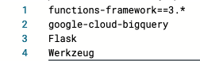

# BLA API

So you've completed the [hello world API call](api_hello_world.md) and loaded BLS data into [BigQuery](bigquery.md).

We're now ready to create a Cloud Function that can dynamically query BigQuery when supplied with the name of a `county` and `state`.

This API will power a simple [Vega-Lite](https://vega.github.io/vega-lite/) line chart that allows users to choose a county to view it's unemployment rate for the last 14 months.

## Hello BLS API

We'll set up this new API in the same way as the [hello world example](api_hello_world.md).

Go to the GCP Console and navigate to the `Cloud Functions` dashboard.

> Remember, you can use the search bar at top of the GCP console.

Once on the Cloud Functions page, click `CREATE FUNCTION` at the top of the page.

This should call up the form to create a new function.

Create a function named `bls` with the following settings:

- Environment: `2nd gen`
- Function name: `bls`
- Region: `us-central1 (Iowa)`
- Trigger type: `HTTPS`
- Authentication: `Allow unauthenticated invocations`

It should look like this:


Click `NEXT` at the bottom of the form.

You should now be on the code configuration page.

Change the `Runtime` to Python 3.11.


That should update the code to Python.

Notice that you are currently editing the `main.py` file in the code editor.

But there's also a `requirements.txt` file, where you can add additional software for your Python program.

In order for our API to query the BLS data over on BigQuery, we'll need to add a new library. We'll also include a web framework called `Flask` and a library called `Werkzeug` that will help us deal with some headaches related to creating an API and working with requests to the API.

Click on `requirements.txt` and add the libraries, each on a separate line: 

- `google-cloud-bigquery`
- `Flask`
- `Werkzeug`

The file should now look like this:



Next, click back over to `main.py`.

Update the `Entry point` value to `county_data`. This is the name of the Python function that will be called when the API's URL is called.

Next, replace the contents of `main.py` with the following code and then click `DEPLOY` at the bottom of the page. This step will take a minute or two.

> We'll walk through each line of this code together.


```python 
import functions_framework

from flask import jsonify, make_response
from google.cloud import bigquery

client = bigquery.Client()


@functions_framework.http
def county_data(request):
    # Grab params from incoming request
    county = request.args['county']
    state = request.args['state']
    query = (
        "SELECT * "
        "FROM hs-research-tumgoren.bls.unemployment "
        f"WHERE county = '{county}' and state = '{state}';"
    )
    query_job = client.query(query)
    data = []
    for row in query_job:
      county = row['county']
      state = row['state']
      data.append({
          'month_abbrev': row['month_name'],
          'date': f"{row['year']}-{row['month']}-01",
          'unemployed': row['unemployed_rate']
      })
    resp = make_response(
      jsonify(
        county=county,
        state=state,
        data=data
      )
    )
    return resp
```

## Test the API

Once the deployment is complete, you should see a green circle with a checkmark and the URL where you can call the API.


Now we can test the new function.

First, get the `Trigger URL` and call it without any parameters. This should return our error message

Next, supply the correct URL parameters, e.g.`?county=Marin County&state=CA`. The query should work this time.

[python bigquery client]: https://cloud.google.com/bigquery/docs/reference/libraries#using_the_client_library


## Plug in the BLS API

So, we've crafted our API and verified that it works.

Now we're ready to try using the API with Vega-Lite.

To streamline things, we've provided you with a starter temnplate for the HTML, CSS and Javascript:

- `index.html`
- `static/css/main.css`
- `static/js/main.js`

Before proceeding, make sure you've cloned this repository to your machine so that you have access to those files.

```bash
git clone git@github.com:zstumgoren/bls-api.git
```

Next, we're going to grab the "Trigger" URL for our GCP Cloud Function.

In your web browser, navigate to your Cloud Function's dashboard and copy the URL at the top of the page.


Now, open `index.html` in a code editor such as VS Code and locate the line that contains the `api_endpoint`. 

The example below shows the endpoint for my Cloud Function. You'll want to replace this value with your own and save the updated file.


With that done, we're ready to test our data visualization.

You'll need to run a web server to test the app. There are a few options on this front.  You could install the LiveServer plugin for VS Code. 

Or just open a Terminal shell, navigate to the top-level folder in this repo, and start a web server using Python:

```bash
# NOTE: Update the below path to wherever you saved this repo on your machine
cd ~/code/bls-api
python -m http.server
```

If you used the Python strategy above, you should now be able to view the site in your browser at http://localhost:8000.

The page is quite simple. Just a brief description of the chart and a web form pre-filled with default values of `Marin County` and `CA`.


Now it's time for the moment of truth. 

Before we test the chart, let's first open up our Developer Tools by right-clicking and choosing `Inspect`.

Then navigate to the `Nework` tab. 

This will allow us to verify that our API is being called when the web form is submitted.

Ok...hit the `Submit` button and...drum roll...

Cue the sad trombone. Our API called failed and, as a result, we don't see a chart displayed.

The `Network` tab offers us some insight into what went wrong.


The `Transferred` column offers an admittedly arcane but important clue about what went wrong. Hover on the value in this column and you'll see `CORS Missing Allow Origin`.

What the heck? Read on for the gory details...

## Enabling CORS

CORS is an acronym for [Cross-Origin Resource Sharing](https://developer.mozilla.org/en-US/docs/Web/HTTP/CORS), and is used to control which "origins" are allowed to access a site's resources. 

It's quite common for sites to limit API access to its own HTML and Javascript files. And sure enough, Cloud Function APIs, even with the `Allow unauthenticated` option selected, will block access by third party code that doesn't originate from the same URL.

There's a simple solution for this. We can update our API code to set certain [HTTP headers](https://developer.mozilla.org/en-US/docs/Glossary/HTTP_header) -- bits of metadata included in web requests and responses -- to allow other origins to access the endpoint.

Head back to the Cloud Function page for the `bls` API and navigate to the `Source` tab.

Click `EDIT` and update the code as detailed below.

Once you've updated the code, click `SAVE AND REDEPLOY`.

```python
import functions_framework

from flask import jsonify, make_response
from google.cloud import bigquery
# ADD THIS LINE
from werkzeug.datastructures import Headers


client = bigquery.Client()

@functions_framework.http
def county_data(request):
    county = request.args['county']
    state = request.args['state']
    query = (
        "SELECT * "
        "FROM hs-research-tumgoren.bls.unemployment "
        f"WHERE county = '{county}' and state = '{state}';"
    )
    query_job = client.query(query)
    data = []
    for row in query_job:
      county = row['county']
      state = row['state']
      data.append({
          'month_abbrev': row['month_name'],
          'date': f"{row['year']}-{row['month']}-01",
          'unemployed': row['unemployed_rate']
      })
    # ADD THESE LIUNES related to Headers
    #  Update headers to allow CORS
    # Better would be to use flask-cors
    headers = Headers()
    headers.add('Access-Control-Allow-Origin', '*')
    headers.add('Access-Control-Allow-Methods', 'GET')
    headers.add('Access-Control-Allow-Headers', 'Content-Type')
    headers.add('Access-Control-Max-Age', '300')
    resp = make_response(
      jsonify(
        county=county,
        state=state,
        data=data
      )
    )
    # ADD THIS line to include headers in response
    resp.headers = headers
    return resp
```

Once the API is deployed -- you should see the little green circle with a check-mark on the Cloud Function dashboard -- you can try testing the chart again.

Head back to your data viz page at http://localhost:8000.

Click `Submit` once again, and you should see a chart such as below.


If you kept your `Network` tab open, you'll also notice that the status of our response has changed to that friendly green color for success, and a [status code](https://developer.mozilla.org/en-US/docs/Web/HTTP/Status) of 200.

Congratulations!! You've created a fully functional data visualiziation backed by an API.

## CORS settings are not about security

It's important to note that it's not necessarily a great idea to allow CORS unless you're building an API intended for public consumption. By allowing origins to access your endpoint, anyone can easily access the data in your API from any "origin".

CORS allows you to restrict access to a web resource by specifiying one or more domains, for example.

But you shouldn't regard CORS as a proper safety measure. It's primarily intended to limit access in a browser context. 

If you were to disable CORS in your Cloud Function, this would break the Vega-Lite chart with the same CORS error we encountered above. 

But it's still possible to access the API by hitting the endpoint directly, for example by simply querying it in a browser URL bar or by using the `curl` command line tool.

```bash
# This still works on the version without 
#  Access-Control-Allow-Origin: '*'

curl -m 70 https://us-central1-hs-research-tumgoren.cloudfunctions.net/bls\?county\=Marin%20County\&state\=CA
-H "Content-Type:application/json"
```

To prevent public access, we'd need to take additional steps such as placing our app behind a login and using a per-user API key, or restricting an API key to a single domain.

These are important topics to explore and potentially integrate into your app if there's a need to lock down your API for reasons related to cost, privacy or competitive edge.

## Spruce things up

You've now completed this tutorial and have a shiny new API-backed data visualization. Nicely done!

Alas, our chart is quite simple and there are many ways to improve on this initial work.

Check out these [exercises](docs/exercises.md) for some potential improvements or brainstorm and build your own ideas.

Happy coding!!