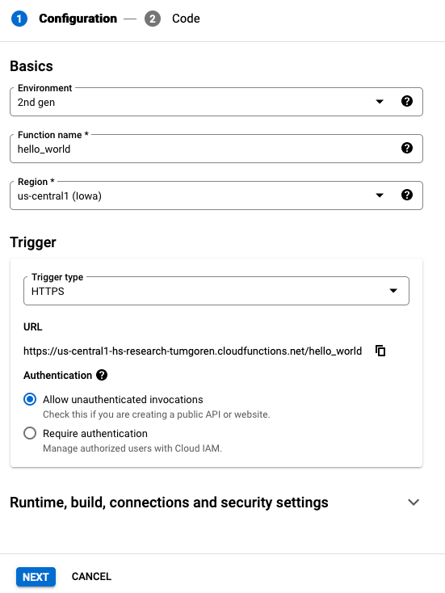
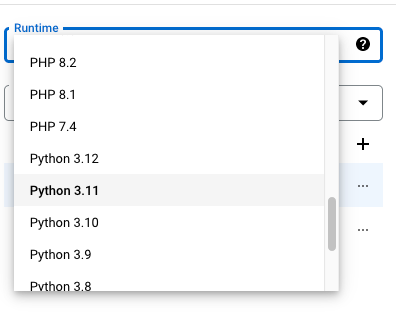
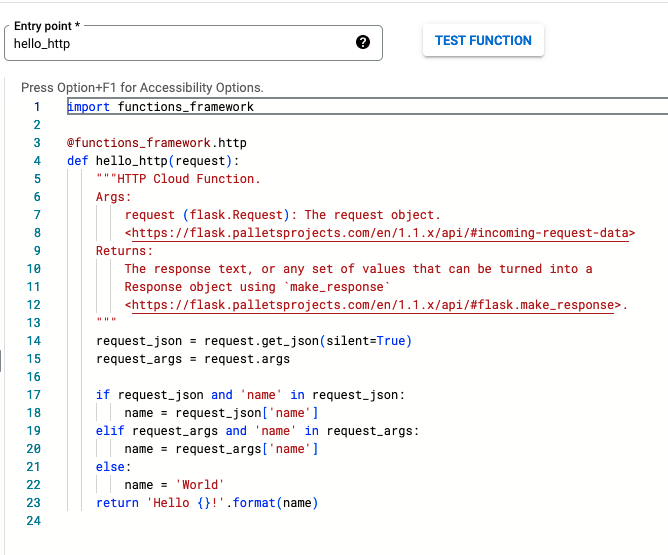
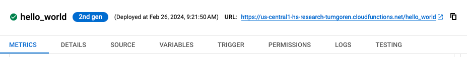

## Hello API

First off, what the heck is an [API](https://en.wikipedia.org/wiki/API)? 

We hear the term all the time and it's been around many years. 

API is an acronym for Application Programming Interface. In general terms, it's a code ["interface"](https://en.wikipedia.org/wiki/Interface_(computing)) that provides a simpler means of access to more complex underlying functionality, data, or both. 

The goal is to make life easier for those using the API -- i.e. the "callers".

In a web context, APIs often take the form of a web application that provides flexible access to data based on a set of specifications.

For example, if we wanted to create a web app that allows users to look up unemployment data by county and state, it would make sense to create an underlying API that accepts `county` and `state` parameters. And in our web application, users might submit `county` and `state` to our API using a standard [web form](https://en.wikipedia.org/wiki/HTML_form).

The plumbing -- how the API goes about accessing data, and where that data is stored -- is something the user doesn't need to worry about.

There are many tools and strategies for creating web APIs, and one of the easiest options these days is the use of functions in the cloud. 

When a cloud function receives a request -- perhaps with some URL paramters -- it then processes that request and returns a web page, JSON, or some other type of response.

A variety of cloud platforms such as [Amazon Web Services](https://aws.amazon.com) and [Google Cloud Platform (GCP)](https://cloud.google.com/) provide cloud functions.

For this tutorial, we'll use  GCP [Cloud Functions](https://cloud.google.com/functions), but just be aware that a variety of companies offer similar functionality (e.g. AWS [Lambdas](https://docs.aws.amazon.com/lambda/latest/dg/welcome.html)).

Before we get to the fancy stuff, we'll start by simply creating a basic API to get a feel for Google Cloud Functions.

We'll then move on to a more sophisticated API tailored for our data visualization app.

## Cloud Functions - hello world

GCP provides the ability to easily create an API ["endpoint"](https://en.wikipedia.org/wiki/Web_API#Endpoints) using basic Python code (or Node.js, or a variety of other languages).

How do we create APIs using Google Cloud Functions?

**First**, make sure you've completed the steps in the [setup docs](setup.md).

Then, log in to GCP and go to the Cloud Functions Dashboard.

You can locate the dashboard using the search bar at the top of the GCP Console:


Select `Cloud Functions` and you should be taken to the dashboard.

Click `CREATE FUNCTION` at the top of the page.

Create a `hello_world` function with the following settings:

- Environment: `2nd gen`
- Function name: `hello_world`
- Region: `us-central1 (Iowa)`
- Trigger type: `HTTPS`
- Authentication: `Allow unauthenticated invocations`

It should look like the below:



Click `Next`.

You should now be on the source code editor screen. You may notice the default starter code is using `node.JS`.

Let's go ahead and change this to a recent version of Python (e.g. 3.11) using the `Runtime` drop-down menu.



Once you've selected `Python 3.11`, the example code should update to our newly selected language.

It provides a handy little `hello_http` function for us.



This code may seem complex, so let's go through a few important points:

- The `hello_http(request)` is the so-called `Entry point` function. This is the top-level function that will be called when a web request is made to this cloud function's URL. 
- The `hello_http` function is [decorated](https://en.wikipedia.org/wiki/Decorator_pattern) with  `@functions_framework.http` in the line above, which imbues `hello_http` with some added functionality that allows it to run in this particular cloud environment. _For the curious, gory details are [here](https://github.com/GoogleCloudPlatform/functions-framework-python)._
- Our cloud function is using a Python web framework called Flask, which expects a `request` argument that contains details about incoming web requests.
- Our code is technically stored in a file called `main.py` (see area to the left of the code editor). 
- Also note `requirements.txt`, where you can add other software libraries required by the function.
- The code logic itself is fairly straightforward:
  - If you call the API, it will simply return the phrase `Hello World!`.
  - If you provide a `name=SomeName` parameter when calling the URL, it will pluck that parameter from the URL and substitute the name in the return message: `Hello SomeName`.

Click the blue `DEPLOY` at page bottom. It'll take a minute or two to deploy, and then we can test our cloud function...

## Triggering our function

While the cloud function deploys, you should be taken to a new screen with a series of tabs. 

These tabs provide details about your cloud function and its configuration, along with the "endpoint", or URL that can be used to call the function.



If you see a check mark in a green circle next to your function's name, it's ready to be called.

Click the URL and you should see a simple `Hello World!` message.

Congrats! You just deployed your first API!! 

But wait, it gets better.

As mentioned earlier, you can also supply a URL parameter by adding a `?` to the end of the URL, followed by `name=SomeName`. 

Try adding `?name=SomeName` to the end of the URL. 

Now replace `SomeName` with your own name.

In my case, the URL looks like this:

```
https://us-central1-hs-research-tumgoren.cloudfunctions.net/hello_world?name=Serdar
```

Each time, you should get back a different message, customized to the name you provided. 

In my case, that's `Hello Serdar!`

OK. You've now successfully set up a basic API URL or, more formally, an "[endpoint](https://en.wikipedia.org/wiki/Web_API#Endpoints)".

You're ready to get a bit fancier by creating an endpoint that queries data stored on the cloud.

Head over to the [BigQuery docs](bigquery.md) to learn about that service and how to connect it with your API to return unemployment data.