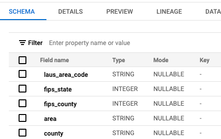

## Data in the Cloud 

In order to create a dynamic API, we'll need to store data in the cloud in a way that allows live querying.

The end goal is to allow a Cloud Function to query for the unemployment data for a given county and state, and then return that data to a web app for display in a [Vega-Lite](https://vega.github.io/vega-lite/) chart.

Data storage and querying is a big subject, and there are myriad ways to store and query data in the cloud. 

Sites/services often use relational databases such as [PostgreSQL](https://www.postgresql.org/) or [key-value stores](https://en.wikipedia.org/wiki/Key%E2%80%93value_database) such as Google's [Cloud Firestore](https://firebase.google.com/docs/firestore) to store data used by APIs and web applications.

These tools provide useful features for varying circumstances, but also pose technical challenges with respect to setup and usage.

[BigQuery](https://cloud.google.com/bigquery/docs) is a simple option for storing and querying data on the Google Cloud Platform. 

It can handle data of varying sizes with a fair degree of speed, and is quite easy to set up and use with basic CSVs. In particular, it allows you to write standard SQL queries against data that you've imported into the system.

Let's grab some data from the Bureau of Labor Statistics (BLS) that we can load into BigQuery.

## Interlude - Get the BLS Data

The BLS provides data on inflation, prices of goods and services, productivity and much more. They provide this data at varying aggregations such as nationwide and state levels.

For this tutorial, we're interested in the recent unemployment rate by county. BLS offers a "rolling" data set for the last 14-months on its page for [Local Area Unemployment Statistics](https://www.bls.gov/lau/tables.htm).

We're specifically interested in the file under the `County` section called [Labor force data by county, not seasonally adjusted, latest 14 months](https://www.bls.gov/web/metro/laucntycur14.txt).

You'll notice that the data is in a rather unfriendly format, at least for use in a spreadsheet or similar tool.

Never fear, we'll handle that in the next step.

For now, right click and save the data to your local computer.

## Clean up the data

As mentioned, the BLS 14-month county data is not structured in ideal format for our purposes.

Now that you've downloaded the data, you can use the [clean_bls_unemployment_data.py](../scripts/clean_bls_unemployment_data.py) script to generate a standardized CSV.

Download the script to the same folder where you saved the `laucntycur14.txt` file from BLS. 

Then open a Terminal shell, navigate to the folder where the script and data are located, run the script:

```bash
# Replace this path with the correct one for your machine
cd ~/Downloads

python clean_bls_unemployment_data.py
```
That should generate a new CSV called `bls_monthly_unemployment_by_county.csv`.

## Load BLS Data into BigQuery

Let's head over to BigQuery and load in our data. 

Once again, you can use the search bar at the top of the GCP Console to locate the BigQuery service.


You should now be on the BigQuery dashboard page.

You should also see the name of your Google Cloud Project in the left sidbar. 

In my case, that's `hs-research-tumgoren`.

Click the three dots on the right and select `Create dataset`.


When the `Create dataset` pops up, type `bls` into the `Dataset ID` field, as below. 

Then click `CREATE DATASET`.


Back over in the left sidebar, you should now see the `bls` dataset listed under your project name. Here's how it looks on my end:


Now you're ready to import the BLS data into a new a table with the dataset.

Click the `+ ADD` button in the upper left corner.

When the side menu opens, choose `Local file` and upload the standardized `bls_monthly_unemployment_by_county.csv` data.


Then click `CREATE TABLE` at the bottom of the form.

You should now see the `unemployment` table listed under the `bls` dataset at the left of your screen.


This will pop up a form that allows you to upload the BLS unemployment data. Fill out the form as show in the image below. The fields you'll need to customize are:

- `Select file`: *Navigate to and select `bls_monthly_unemployment_by_county.csv` on your local machine.*
- `Dataset`: `bls`
- `Table`: `unemployment`
- `Schema`: Check the box for `auto detect`. This will automatically identify data types for each column, such as string for county name and float for unemployment rate


You can now click on the name of the `unemployment` table and you'll see a dashboard with a number of options.

The default screen is `SCHEMA`, which shows the data types that were inferred.



You can click on `PREVIEW` to review a sample of the data.


And of course, there's  a `QUERY` button at top. That's what we'll use to write [Structured Query Language](https://simple.wikipedia.org/wiki/Structured_Query_Language), or SQL, to query our newly imported data.

## Query the data

SQL is a language used with databases to define tables and query/manipulate data.

BigQuery allows us to write SQL to query our own data. Click the `QUERY` tab and you'll see a default query. Update it as below to select all fields from the data for 10 records.

> NOTE: You should see your own project name in the `FROM` line instead of `hs-research-tumgoren`.

```sql
SELECT * FROM `hs-research-tumgoren.bls.unemployment` LIMIT 10
```

Once you've updated the SQL, click the `RUN` button.

You should see the selected records and fields at the bottom in the `Query Results` pane.


Congratulations! You just ran your first SQL query against the BLS data! Easy, right?

## Get data by county

We're now ready to begin crafting a query to select data by county.

Remember, the end goal here is to create a web app that allows users to visualize the unemployment rate for a given county for the last 14 months.

So we know we need a query that can pinpoint that data by the county name and state.

For example, to locate BLS data for `Marin County, CA`.

```sql
SELECT * 
FROM hs-research-tumgoren.bls.unemployment
WHERE county = 'Marin County'
 AND state = 'CA'
;
```

This query pulls all the fields in our table. But we know that our data visualization only requires the unemployment rate. We'll know the county and state the user queried when she submits the web form, so technically we don't  need those fields. But let's select those as well to simplify some things downstream.

Here's the updated query.

```sql
SELECT state, county, unemployed_rate
FROM hs-research-tumgoren.bls.unemployment
WHERE county = 'Marin County'
 AND state = 'CA'
;
```

If you feel like tinkering with BigQuery a bit more, here are some analysis-oriented questions you can try answering by writing SQL:

* Counties with highest and lowest unemployment rates?
* Largest counties with highest/lowest unemployment?
* Counties sorted by labor force

